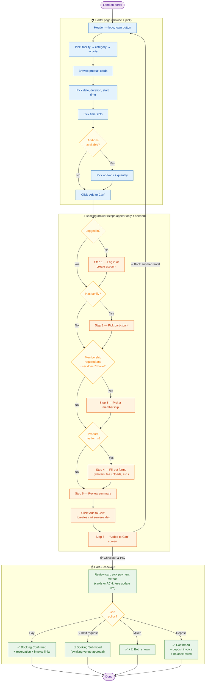

# Consumer Booking Flow — User Diagram

**One-page map of how a consumer goes from "land on portal" to "booking confirmed."**

Covers all 13 tickets in the Rentals v2 consumer epic ([BOND-16799](https://bond-sports.atlassian.net/browse/BOND-16799)). Designed to be read top-to-bottom by anyone — no engineering background required.

---

## The flow at a glance

---

## Logged in vs. guest — what changes

| What you see | 👤 Guest (logged out) | 🔓 Logged in |
|---|---|---|
| **Header right** | "Log in" button | Sign out + "Booking for {name}" + family switcher |
| **"Log in to see pricing and VIP dates" strip** | Visible under product row | Hidden |
| **Date selector** | Standard windows only | Includes VIP / advance-access windows |
| **Slot prices** | List price | Member pricing + entitlement discounts applied; "Free for members" when $0 |
| **Customer-gated products** | Hidden | Visible when participant matches the gate |
| **Membership-gated products** | Show gating icon, blocked at checkout | Show icon, but the membership step lets you add the required pass |
| **Booking limits** | Generic limits only | Personal limits applied (max sequential hrs, max hrs/day, existing-booking conflicts for the participant) |
| **Forms** | All blank | Email / phone / address / birthday auto-prefill from profile |
| **Add-ons, taxes, fees** | Same for both | Same for both |

> 💡 **Switching participant** mid-flow re-runs everything for the new person: slot pricing, membership eligibility, form prefill (clears the previous participant's answers).

---

## Checks the system runs at each step

**When picking time slots** (BOND-17526)
- ⏱ Max sequential hours (e.g. "no more than 3 hours back-to-back")
- 📅 Max booking hours per day
- 🚫 No conflicts with existing bookings (logged in only)
- 🛒 Slots already in your cart can't be picked again

**When picking add-ons** (BOND-17529)
- 🧱 Tied to a reservation — hidden until at least one slot is picked
- 🎯 Slot-level / hour-level add-ons recalculate when you add or remove slots

**Membership step** (BOND-17531)
- ✅ Auto-skipped if the participant already has a qualifying membership
- 🔁 Re-evaluates when you change participant or product

**Forms step** (BOND-17532)
- ⚠️ Mandatory questions block "Continue"
- 📜 Mandatory waivers must be scrolled to the bottom before checking
- 📎 File uploads: PNG, JPG, PDF only

**Cart screen** (BOND-17536)
- 💳 Pay button disabled until a payment method is selected
- 🔄 Fees recalculate when you switch payment method (card vs ACH)
- 🔒 Required-membership lines can't be removed while their reservation is still in the cart

---

## Three rules the whole flow lives by

1. **One participant per booking.** Different participant = different booking summary = separate reservation.
2. **The cart sticks around.** As long as you don't sign out or pay, your cart stays. Cart icon disappears when it's empty.
3. **No silent surprises.** Anything Bond changes (slot conflicts, price updates, removed items) shows a human message, never a raw error.

---

## Ticket map

| Step in flow | Ticket |
|---|---|
| Header | [BOND-17521](https://bond-sports.atlassian.net/browse/BOND-17521) |
| Selection row (facility / category / activity) | [BOND-17522](https://bond-sports.atlassian.net/browse/BOND-17522) |
| Product cards + sign-in strip | [BOND-17523](https://bond-sports.atlassian.net/browse/BOND-17523) |
| Schedule settings (date / duration / start) | [BOND-17524](https://bond-sports.atlassian.net/browse/BOND-17524) |
| Slot display & selection | [BOND-17526](https://bond-sports.atlassian.net/browse/BOND-17526) |
| Login + participant | [BOND-17528](https://bond-sports.atlassian.net/browse/BOND-17528) |
| Add-ons | [BOND-17529](https://bond-sports.atlassian.net/browse/BOND-17529) |
| Membership gating (in drawer) | [BOND-17531](https://bond-sports.atlassian.net/browse/BOND-17531) |
| Forms (in drawer) | [BOND-17532](https://bond-sports.atlassian.net/browse/BOND-17532) |
| Booking summary (in drawer) | [BOND-17533](https://bond-sports.atlassian.net/browse/BOND-17533) |
| "Added to cart" confirmation | [BOND-17535](https://bond-sports.atlassian.net/browse/BOND-17535) |
| Cart & checkout | [BOND-17536](https://bond-sports.atlassian.net/browse/BOND-17536) |
| Booking confirmation (Confirmed / Submitted) | [BOND-17537](https://bond-sports.atlassian.net/browse/BOND-17537) |

**Epic:** [BOND-16799 — Rentals 2.0 → Create the bond default portal experience](https://bond-sports.atlassian.net/browse/BOND-16799)
