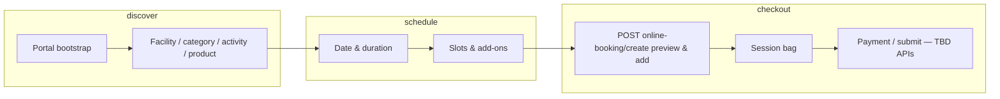

# Rental portal — frontend technical design (draft)

**Status:** Living draft in-repo. **Notion:** Create a page from this content after you confirm a parent page, Jira epic/key (if any), and Figma link — paste sections below into the team FE template.

**Canonical product phases:** `docs/RENTAL_PORTAL_PLAN.md`  
**Implementation handoff:** `docs/IMPLEMENTATION_AND_ROADMAP.md`  
**API contract:** [Squad C public Swagger](https://public.api.squad-c.bondsports.co/public-api/)

---

## 1. Architecture (browser → BFF → Bond)

- **BFF:** `/api/bond/v1/organization/...` — server-only `X-Api-Key`; forwards user JWTs from httpOnly cookies set by `/api/bond-auth/*`.
- **Client HTTP:** `bond-client.ts` + `bond-json.ts`; domain wrappers `online-booking-api.ts`, `online-booking-user-api.ts`.
- **Auth:** Consumer login via `/api/bond-auth/login` | `session` | `logout`; session drives `userId` on schedule/required-products/create.
- **State:** TanStack Query; booking URL synced via `booking-url.ts` + `useBookingUrlState`.
- **i18n:** `next-intl`, `messages/en.json` (booking, checkout, auth, errors, etc.).
- **Theming:** `resolveBookingThemeStyle` maps portal `options.branding` (+ env + URL dev overrides) to `--cb-*` CSS variables; optional neutrals when API provides tokens (`PortalBranding` in `src/types/online-booking.ts`).

---

## 2. User scenarios

| Actor | Notes |
|--------|--------|
| **Guest** | Sees schedule/products; sign-in prompt for eligibility/VIP dates; checkout may require login. |
| **Logged-in** | `GET …/user`, family members, booking-information, required products, questionnaires; **Booking for** (`BookingForDrawer`) selects participant. |
| **Multi-participant** | Cart grouping by person; switching participant clears membership/required selections where applicable. |

---

## 3. Core flows

- **Schedule views:** Driven only by portal `options.views` and `defaultView` (see `booking-views.ts`); URL `view=` only when still allowed by API.
- **Checkout:** Steps — add-ons → membership (if required) → forms → confirm → payment placeholder; **approval** categories defer create until submit; **cart merge** via `cartId` when Bond returns it.

---

## 4. Open issues (product / API)

| Item | Status / owner |
|------|----------------|
| Unit tests (lib + critical hooks) | TBD |
| E2E / automation | TBD |
| SSO / full Bond auth beyond BFF cookies | In progress / TBD |
| Payment methods (list + add) | TBD |
| Purchase / pay endpoints | TBD |
| Remove cart line items API | Blocked on Bond |
| Mixed category products + rulesets | Design TBD |
| Runtime config (no hardcoded org/portal for prod) | Admin / host config TBD |
| Embed (isolation, postMessage, cookies) | Future |
| Bond analytics | Future |

---

## 5. Embed & white-label (future)

- Scope `.consumer-booking`; consider shadow DOM if host CSS leaks.
- Hash-only or in-memory routing option if URL sync conflicts with host.
- Third-party iframe: cookie / SSO constraints; possible top-level handoff.

---

## 6. Verification

- `pnpm exec tsc --noEmit`
- `pnpm lint`
- Manual smoke: guest + logged-in, participant switch, bag merge, confirm preview errors.
