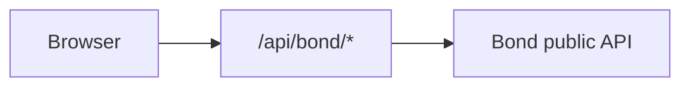

# Rental portal — implementation status & handoff

**Purpose:** Single document for humans and agents: what exists in `rental-portal-fun`, how it fits together, and what to build when new Bond public APIs land.  
**Product / phase framing:** `docs/RENTAL_PORTAL_PLAN.md` (Phase 1 discovery + schedule, Phase 2 checkout).  
**API contract:** [Squad C public Swagger](https://public.api.squad-c.bondsports.co/public-api/).

---

## Constraints (non-negotiable)

- Repo is **standalone** from Bond `squad-c`. Integration is **hosted HTTP APIs only**.
- **`X-Api-Key` never** in browser code or `NEXT_PUBLIC_*`. All Bond calls go through **`/api/bond/...`** (BFF).
- BFF already forwards optional **`X-BondUserAccessToken`** / **`X-BondUserIdToken`** from incoming request headers when present (`src/app/api/bond/[...path]/route.ts`) — wire these from auth when Phase 2 lands.

---

## Environment variables

| Variable | Where | Purpose |
|----------|--------|---------|
| `BOND_API_BASE_URL` | Server | Bond public API base (no trailing slash) |
| `BOND_API_KEY` | Server | API key for BFF → Bond |
| `NEXT_PUBLIC_BOND_ORG_ID` | Client | Default organization id |
| `NEXT_PUBLIC_BOND_PORTAL_ID` | Client | Default online-booking portal id |
| `NEXT_PUBLIC_BOOKING_PRIMARY` / `ACCENT` / `SUCCESS` | Client | Optional theme defaults |
| `NEXT_PUBLIC_BOOKING_FONT_FAMILY` / `NEXT_PUBLIC_BOOKING_FONT` | Client | Optional font overrides |
| `NEXT_PUBLIC_BOOKING_APPEARANCE` | Client | `system` \| `light` \| `dark` default |

---

## URL query parameters

**Booking state** (read/write via `readBookingUrl` / `writeBookingUrl` in `src/components/booking/booking-url.ts`):

- `facility`, `category`, `activity`, `product`, `date`, `duration`, `view` (`list` \| `calendar` \| `matrix`), `page` (products)

**Dev / testing overrides** (preserved on every `writeBookingUrl(..., searchParams)`):

- `orgId` or `org` — overrides `NEXT_PUBLIC_BOND_ORG_ID`
- `portalId` or `portal` — overrides `NEXT_PUBLIC_BOND_PORTAL_ID`
- `primary`, `accent`, `secondary` (alias for accent), `success` — hex colors (`#` URL-encoded as `%23`)

Theme resolution order: **URL → portal `options.branding` → env → CSS defaults** (`src/lib/booking-theme.ts`).

---

## Architecture

- **BFF:** `src/app/api/bond/[...path]/route.ts` — only allows paths under `v1/organization/...`; GET/POST; attaches `X-Api-Key`.
- **Client HTTP:** `src/lib/bond-json.ts` (`bondBffGetJson`, `BondBffError`), `src/lib/bond-client.ts` (path builder).
- **Domain API wrappers:** `src/lib/online-booking-api.ts` — portal, products, schedule settings, schedule (+ recovery variants for flaky instructor/lesson-style queries).
- **UI state:** `@tanstack/react-query` in `src/app/providers.tsx`.
- **Main screen:** `src/components/booking/BookingExperience.tsx` (large; contains schedule matrix table, URL sync, queries).

---

## What is built (inventory)

### Portal bootstrap & navigation

- Load portal: `GET .../online-booking/portals/{portalId}`.
- Breadcrumb / picker modals: facility, category, activity (`booking-picker-bodies.tsx`, `ModalShell.tsx`).
- **URL sync:** selection normalized against portal defaults (`resolveBookingState`); invalid values fall back to API defaults.

### Products

- Paginated list: `GET .../category/{categoryId}/products` with `facilitiesIds`, `sports`.
- Horizontal **service cards** with image (Unsplash / org URL / fallback), price pill, variable-pricing (peak) indicator, tags (member benefits, punch pass, members only, **optional add-ons**).
- **Product detail** modal: description (sanitized HTML), pricing, **add-ons list** with billing level.
- Pagination controls; default product selection when list changes.

### Date, duration, preferred start

- Schedule **settings** drive available dates; **advance booking window** and **minimum notice** from category `settings` (`category-booking-settings.ts`, `filterDatesByAdvanceWindow`, `booking-schedule-start.ts`).
- Date strip + calendar modal (`AvailableDateCalendarBody.tsx`); schedule pills for date / duration / optional preferred start.
- Portal `startTimeIntervals` / `enableStartTimeSelection` respected; schedule fetch can use `date` or `dateTstart` style param when a preferred start is chosen.

### Schedule & slots

- **Settings:** `GET .../online-booking/schedule/settings`.
- **Slots:** `GET .../online-booking/schedule` with `facilityId`, `productId`, `date`, `duration`, `timeIncrements` (zeros omitted).
- **Views:** calendar (`ScheduleCalendarView.tsx`), matrix (inline table in `BookingExperience.tsx`), list view label in portal (client may still map list → calendar per `booking-views.ts`).
- **“Unavailable slots hidden” / “Hide unavailable slots”** toggle (calendar); filters disabled/full slots client-side.
- **Slot selection** with validation: max hours per day + max sequential hours from category `default` settings; Bond sends **`maxBookingHours`** / **`maxSequentialBookings`** as `{ amount, unit }` — parsed in `category-booking-settings.ts` (`hoursLimitFromSetting`).
- **Loading UX:** single primary loader under “Available times” when both settings + slots pending; refetch line “Cooking up some fresh slots…”; delayed fun copy on portal load (`BookingDelayedFunLoader`, `booking-loading-copy.ts`).

### Add-ons (packages / `isAddon`)

- Source: `product.packages` entries with **`isAddon: true`**; nested package arrays walked (`product-package-addons.ts`).
- Fields used: nested **`product`**, **`level`** (`reservation` \| `slot` \| `hour`), **`price`** on package row (`packagePrice`), **`isAddon`**.
- **UI rules:** add-on panel only after **at least one slot** selected (including per-reservation add-ons — avoids implying purchase without times).
- **Reservation:** subsection “With your reservation”; one flat charge copy.
- **Slot / hour:** subsection “For your selected times”; per-addon **select all** + per-slot chips; targeting state `addonSlotTargeting` (`BookingAddonPanel.tsx`); pruning when slots change (`BookingExperience.tsx` effects).
- **Pricing display:** card shows `+price` + `/ reservation` \| `/ slot` \| `/ hr`. Per-slot **estimated** lines on chips were removed per UX request; **`addonEstimatedChargeForSlot`** remains in `product-package-addons.ts` for future cart/checkout math.

### Theming & layout

- CSS variables `--cb-primary`, `--cb-accent`, `--cb-success`, fonts (`globals.css` under `.consumer-booking`).
- **Sticky** full-bleed header with glass-style backdrop.
- **Selection bar** (portaled): cart FAB uses **accent** background + **primary** icon; **Book** CTA uses **primary** background (not success green).
- Light/dark/system appearance cycle (localStorage).

### Misc UX

- Sign-in hint with prominent **“Sign in now”** button (no auth wired).
- Bond error shaping for BFF responses (`bond-errors.ts`).
- Optional **recovery** schedule requests when Bond returns certain errors (`online-booking-api.ts` — instructor / alternate resource experiments).

### Types

- `src/types/online-booking.ts` — portal, products, schedule DTOs; category `settings` intentionally loose.

---

## Known issues / deferred

- **Lessons / instructor-as-resource:** Same bad responses observed in **Swagger** and the app; **no further lesson-specific fixes** until API behavior is confirmed. `fetchBookingScheduleRecovering` already tries query variants; `resourcesIds` / duration / date combos may need API-side clarity.
- **BFF hardening:** Plan item — stricter allowlists, logging, rate limits — not fully done.
- **OpenAPI-generated client:** Not adopted; hand-maintained types + fetch.

---

## Outstanding work (for next APIs / agents)

Use Swagger as source of truth when endpoints appear or change.

### 1. Auth

- Login / register / token refresh per public API.
- Store session (prefer **httpOnly cookies** or pattern Bond documents); pass tokens to BFF via headers already supported on the route.
- Replace placeholder **Sign in now** with real navigation or modal.

### 2. Authenticated user context

- **getUser** (or equivalent) after login.
- Thread **`userId`** (or documented param) into:
  - `schedule` / `schedule/settings` if API supports member-specific windows.
  - Product list if **member-only** or **customer-gated** filtering is server-driven.

### 3. Member / VIP / entitlements (product requirements)

- **advancedWindows** (or similar): merge with `filterDatesByAdvanceWindow` so calendar extends for eligible members.
- **Members-only** & **customer-gated** products: filter or unlock in UI per API rules.
- **Entitlements / discounts:** reflect in slot price display, product cards, add-ons where API provides adjusted pricing.
- **Family members:** load list, switch “booking for” context, pass ids to relevant calls per spec.

### 4. Questionnaires

- Fetch required questionnaires; block or gate checkout until complete; submit answers before create.

### 5. Cart

- Server cart APIs per OpenAPI; line items: base product, selected slots (resource + time keys), add-ons with **level** + slot targeting map.
- Persist cart id; sync with UI selection bar.

### 6. Payment & create reservation

- `POST` create / pay flows per **`docs/bond/PUBLIC_APIS_FOR_AGENTS.md`** and Swagger (e.g. online-booking create, cart).
- Handle errors, 3DS if applicable, success / failure UI.

### 7. Product / checkout integration for add-ons

- Map `selectedAddonIds` + `addonSlotTargeting` + `PickedSlot[]` into whatever DTO Bond expects.
- Use **`addonEstimatedChargeForSlot`** (and reservation flat) for previews; trust server for final totals.

### 8. Low priority — dev / admin

- Small UI or extended URL params for **portal picker** (already partially via query).
- **Code cleanup:** split `BookingExperience.tsx`, tighten ESLint exceptions (`set-state-in-effect` for addon pruning), tests for `category-booking-settings` / `product-package-addons`.

---

## File map (quick reference)

| Area | Files |
|------|--------|
| BFF | `src/app/api/bond/[...path]/route.ts` |
| Bond fetch / errors | `src/lib/bond-json.ts`, `bond-client.ts`, `bond-errors.ts` |
| Online booking API | `src/lib/online-booking-api.ts` |
| URL / dev overrides | `src/components/booking/booking-url.ts` |
| Theme | `src/lib/booking-theme.ts` |
| Category rules / durations | `src/lib/category-booking-settings.ts` |
| Slot validation | `src/lib/slot-selection.ts` |
| Add-ons | `src/lib/product-package-addons.ts`, `BookingAddonPanel.tsx` |
| Main UI | `BookingExperience.tsx`, `ScheduleCalendarView.tsx`, `BookingSelectionPortal.tsx`, `ProductDetailModal.tsx` |
| Styles | `src/app/globals.css` (`.consumer-booking` block) |
| Entry | `src/app/page.tsx`, `layout.tsx`, `providers.tsx` |

---

## Handoff checklist for the next agent

1. Read **`docs/RENTAL_PORTAL_PLAN.md`** + this file.
2. Confirm **`BOND_API_*`** and **`NEXT_PUBLIC_BOND_*`** in `.env.local`; use **`?orgId=&portalId=`** for multi-portal checks.
3. Open **Swagger** for the exact operationIds / schemas for new endpoints.
4. Extend **`online-booking-api.ts`** (or add `src/lib/auth-api.ts`, `cart-api.ts`, etc.) — thin wrappers around `bondBffGetJson` / POST helpers.
5. Add React Query keys colocated with fetchers; avoid duplicating org/portal id — reuse **`useBondEnv(searchParams.toString())`** pattern from `BookingExperience.tsx`.
6. Never add **`X-Api-Key`** to client bundles; use BFF only.

---

*Last updated to reflect the state of the repo at handoff; keep this file in sync when major features land.*
