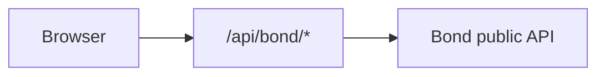

# Rental portal — implementation status & handoff

**Purpose:** Single document for humans and agents: what exists in `rental-portal-fun`, how it fits together, and what to build when new Bond public APIs land.  
**Product / phase framing:** `docs/RENTAL_PORTAL_PLAN.md` (Phase 1 discovery + schedule, Phase 2 checkout).  
**API contract:** [Squad C public Swagger](https://public.api.squad-c.bondsports.co/public-api/).

---

## Constraints (non-negotiable)

- Repo is **standalone** from Bond `squad-c`. Integration is **hosted HTTP APIs only**.
- **`X-Api-Key` never** in browser code or `NEXT_PUBLIC_*`. All Bond calls go through **`/api/bond/...`** (BFF).
- BFF forwards **`X-BondUserAccessToken`** / **`X-BondUserIdToken`** from request headers **or** httpOnly cookies (`src/app/api/bond/[...path]/route.ts`).

---

## Environment variables

| Variable | Where | Purpose |
|----------|--------|---------|
| `BOND_API_BASE_URL` | Server | Bond public API base (no trailing slash) |
| `BOND_API_KEY` | Server | API key for BFF → Bond |
| `NEXT_PUBLIC_BOND_ORG_ID` | Client | Default organization id |
| `NEXT_PUBLIC_BOND_PORTAL_ID` | Client | Default online-booking portal id |
| `NEXT_PUBLIC_BOOKING_PRIMARY` / `ACCENT` / `SUCCESS` | Client | Optional theme defaults |
| `NEXT_PUBLIC_BOOKING_FONT_FAMILY` / `NEXT_PUBLIC_BOOKING_FONT` | Client | Optional font overrides |
| `NEXT_PUBLIC_BOOKING_APPEARANCE` | Client | `system` \| `light` \| `dark` default |

---

## URL query parameters

**Booking state** (read/write via `readBookingUrl` / `writeBookingUrl` in `src/components/booking/booking-url.ts`):

- `facility`, `category`, `activity`, `product`, `date`, `duration`, `view` (`list` \| `calendar` \| `matrix`), `page` (products)

**Dev / testing overrides** (preserved on every `writeBookingUrl(..., searchParams)`):

- `orgId` or `org` — overrides `NEXT_PUBLIC_BOND_ORG_ID`
- `portalId` or `portal` — overrides `NEXT_PUBLIC_BOND_PORTAL_ID`
- `primary`, `accent`, `secondary` (alias for accent), `success` — hex colors (`#` URL-encoded as `%23`)

Theme resolution order: **URL → portal `options.branding` → env → CSS defaults** (`src/lib/booking-theme.ts`).

---

## Architecture

- **BFF:** `src/app/api/bond/[...path]/route.ts` — only allows paths under `v1/organization/...`; GET/POST; attaches `X-Api-Key`; forwards user JWTs from httpOnly cookies set by `/api/bond-auth/login`.
- **Client HTTP:** `src/lib/bond-json.ts` (`bondBffGetJson`, `bondBffPostJson`, `BondBffError`), `src/lib/bond-client.ts` (path builder).
- **Domain API wrappers:** `src/lib/online-booking-api.ts` — portal, products, schedule settings, schedule (+ recovery). **`src/lib/online-booking-user-api.ts`** — `getUser`, booking-information, questionnaires, required products, `POST .../online-booking/create`.
- **UI state:** `@tanstack/react-query` in `src/app/providers.tsx`.
- **Main screen:** `src/components/booking/BookingExperience.tsx` (large; contains schedule matrix table, URL sync, queries).

### Online booking — `OrganizationCartDto` vs client state

| Layer | Source |
|-------|--------|
| Slots, add-on selection, `pickedSlots`, `addonSlotTargeting` | Client (`BookingExperience`, `BookingCheckoutDrawer`) |
| Request body for `POST …/online-booking/create` | `online-booking-create-body.ts` → BFF |
| `OrganizationCartDto` (`cartItems`, `discounts[]`, `subtotal`, `tax`, `total`, …) | Bond response only |
| Receipt line boxes | `getBondCartReceiptLineItems` → `cartItems[]` (`metadata.description` when Bond sends it — `bond-cart-item-classify.ts`) |
| Create body vs cart line DTOs | `docs/bond/CART_ITEM_AND_CREATE_BOOKING.md` |
| Subtotal / discount / tax / total rows on confirm | `getBondCartReceiptSummaryRows`, else `getBondCartPricingDisplayRows` (`checkout-bag-totals.ts`) |
| Cart line list | `expandSnapshotForPurchaseList` (`cart-purchase-lines.ts`) — `cartItems[]` via `cartItemLineAmountFromDto` |

Preview and add-to-cart use the same endpoint; Bond may return fewer fields on the preview request than after a persisted cart.

---

## What is built (inventory)

### Portal bootstrap & navigation

- Load portal: `GET .../online-booking/portals/{portalId}`.
- Breadcrumb / picker modals: facility, category, activity (`booking-picker-bodies.tsx`, `ModalShell.tsx`).
- **URL sync:** selection normalized against portal defaults (`resolveBookingState`); invalid values fall back to API defaults.

### Products

- Paginated list: `GET .../category/{categoryId}/products` with `facilitiesIds`, `sports`.
- Horizontal **service cards** with image (Unsplash / org URL / fallback), price pill, variable-pricing (peak) indicator, tags (member benefits, punch pass, members only, **optional add-ons**).
- **Product detail** modal: description (sanitized HTML), pricing, **add-ons list** with billing level.
- Pagination controls; default product selection when list changes.

### Date, duration, preferred start

- Schedule **settings** drive available dates; **advance booking window** and **minimum notice** from category `settings` (`category-booking-settings.ts`, `filterDatesByAdvanceWindow`, `booking-schedule-start.ts`).
- Date strip + calendar modal (`AvailableDateCalendarBody.tsx`); schedule pills for date / duration / optional preferred start.
- Portal `startTimeIntervals` / `enableStartTimeSelection` respected; schedule fetch can use `date` or `dateTstart` style param when a preferred start is chosen.

### Schedule & slots

- **Settings:** `GET .../online-booking/schedule/settings`.
- **Slots:** `GET .../online-booking/schedule` with `facilityId`, `productId`, `date`, `duration`, `timeIncrements` (zeros omitted).
- **Views:** calendar (`ScheduleCalendarView.tsx`), matrix (inline table in `BookingExperience.tsx`), list view label in portal (client may still map list → calendar per `booking-views.ts`).
- **“Unavailable slots hidden” / “Hide unavailable slots”** toggle (calendar); filters disabled/full slots client-side.
- **Slot selection** with validation: max hours per day + max sequential hours from category `default` settings; Bond sends **`maxBookingHours`** / **`maxSequentialBookings`** as `{ amount, unit }` — parsed in `category-booking-settings.ts` (`hoursLimitFromSetting`).
- **Loading UX:** single primary loader under “Available times” when both settings + slots pending; refetch line “Cooking up some fresh slots…”; delayed fun copy on portal load (`BookingDelayedFunLoader`, `booking-loading-copy.ts`).

### Add-ons (packages / `isAddon`)

- Source: `product.packages` entries with **`isAddon: true`**; nested package arrays walked (`product-package-addons.ts`).
- Fields used: nested **`product`**, **`level`** (`reservation` \| `slot` \| `hour`), **`price`** on package row (`packagePrice`), **`isAddon`**.
- **UI rules:** add-on panel only after **at least one slot** selected (including per-reservation add-ons — avoids implying purchase without times).
- **Reservation:** subsection “With your reservation”; one flat charge copy.
- **Slot / hour:** subsection “For your selected times”; per-addon **select all** + per-slot chips; targeting state `addonSlotTargeting` (`BookingAddonPanel.tsx`); pruning when slots change (`BookingExperience.tsx` effects).
- **Pricing display:** card shows `+price` + `/ reservation` \| `/ slot` \| `/ hr`. Per-slot **estimated** lines on chips were removed per UX request; **`addonEstimatedChargeForSlot`** remains in `product-package-addons.ts` for future cart/checkout math.

### Theming & layout

- CSS variables `--cb-primary`, `--cb-accent`, `--cb-success`, fonts (`globals.css` under `.consumer-booking`).
- **Sticky** full-bleed header with glass-style backdrop.
- **Selection bar** (portaled): cart FAB uses **accent** background + **primary** icon; **Book** CTA uses **primary** background (not success green).
- Light/dark/system appearance cycle (localStorage).

### Misc UX

- **Auth:** consumer login via `/api/bond-auth/*`; header user control + **“Sign in now”** opens login modal; **Book now** in the bottom bar calls `POST .../online-booking/create` (payload from `online-booking-create-body.ts` — align with Bond if 400).
- **Logged-in:** `userId` on schedule queries; `getUser` + booking-information; product **`forms`** drive questionnaire title prefetch.
- Bond error shaping for BFF responses (`bond-errors.ts`).
- Optional **recovery** schedule requests when Bond returns certain errors (`online-booking-api.ts` — instructor / alternate resource experiments).

### Types

- `src/types/online-booking.ts` — portal, products, schedule DTOs; category `settings` intentionally loose.

### Checkout (implemented — extensions in Roadmap)

- **BFF** to Bond only; `POST .../online-booking/create` via `online-booking-user-api.ts` (`buildOnlineBookingCreateBody` — `segments` + flat `addonProductIds` + optional `answers` per Bond DTO). Hosted OpenAPI may omit `requestBody` for this operation; see `online-booking-create-body.ts`. Optional `cartId` when merge/update is documented.
- **Flow:** Bottom bar opens checkout → user completes steps → **Add to cart** runs `create`. Each successful add appends a `OrganizationCartDto` to the session bag until an update-cart API exists.
- **Approval:** create deferred until checkout **Submit request**; then clear session cart + slot selection + invalidate schedule query.
- **Payment / Pay now / saved cards:** UI placeholders only until Phase 4 (see **Pinned** below).

#### Checkout UX & gating (recent)

- **Bond auth:** `/api/bond-auth/*`; login modal; session; **“Who is this booking for?”** drawer (`BookingForDrawer`) — family picker; **stacking** above checkout drawer (z-index) so it is usable after login.
- **Required products** (`GET .../products/{productId}/user/{userId}/required`): extended `ExtendedRequiredProductDto` parsing (`required-products-extended.ts`); **membership OR** vs **other required**; **membership step** in checkout (drawer) when Bond still lists membership options; **no separate modal** in the default flow.
- **Membership panel** shows **“Booking for [name]”**; header **Booking for** is clickable to switch family member — switching clears membership/required selections and refetches required products.
- **Booking summary (confirm):** line prices for required add-ons when Bond sends `prices[]`; **totals** sum rental + required + optional add-ons (see **Open questions** below for server vs client truth).
- **Approval checkout payment step:** synthetic **Purchases** lines for deferred create — rental + each required + optional add-ons (so totals are not rental-only).
- **Errors:** `ONLINE_BOOKING.INVALID_PRODUCT` with reservation/eligibility wording mapped to friendly copy (customer + org name) in `bond-errors.ts`.
- **Selection bar / cart FAB:** visible when session cart exists even without a product in URL; cart FAB **clickable** when bag + slots coexist; overlay rules adjusted so FAB is not hidden unnecessarily.
- **Family member hints:** “Membership” pill when required-products API still lists a membership for that person (`required-products-eligibility.ts` — informational, not blocking).
- **Questionnaires:** collapsed panels auto-advance when a form is fully satisfied (`CheckoutQuestionnairePanels`).
- **Welcome toast:** ~3s default.

---

### Open questions (product / API — align with Bond)

| Topic | Notes |
|--------|--------|
| **Cart vs reservation** | Today **`POST .../online-booking/create`** builds reservation + cart together. **Client-side price/total math** is best-effort for UX until Bond exposes authoritative line items or a **cart-first** flow. Discuss with Bond whether to create **cart first**, then **reservation** separately, or return priced line items on an existing cart endpoint. |
| **Booking limits & windows** | `GET .../online-booking/user/{userId}/booking-information` + category `settings` — **max bookings per day / consecutive / advance window / active membership** checks: **not** fully wired at slot selection + checkout (see Phase 3 backlog). |

---

## Roadmap backlog

**Contract:** [Squad C Swagger](https://public.api.squad-c.bondsports.co/public-api/). Extend `src/lib/online-booking-*.ts` with thin BFF-backed wrappers; never add `X-Api-Key` client-side.

### Pinned — not in active build

| Topic | Status | Notes |
|--------|--------|--------|
| **SSO / enterprise identity** | **Pinned** | Current path: Bond consumer login via `/api/bond-auth/*` + httpOnly cookies. Revisit when org SSO requirements and Bond/OIDC contract are defined. |
| **Payment methods (list + add)** | **Pinned** | Checkout shows placeholders. Implement list/add + processor when Bond exposes consumer payment APIs and gateway choice is fixed. |
| **Instant pay (charge at checkout)** | **Blocked on ↑** | Depends on saved instruments + pay endpoints. |

Everything below assumes **hosted Bond public APIs** and existing BFF patterns.

---

### Phase 3 — Entitlements, gating, and booking rules (priority)

| # | Track | Status | Work |
|---|--------|--------|------|
| 3.1 | **Required products** | **Partial** | Membership + nested required products in create payload; dedicated **membership step**; summary + approval **purchases** lines. **Remaining:** optional stricter blocking rules; Swagger alignment if payloads change. |
| 3.2 | **Entitlements — forms** | **Not done** | Map questionnaire answers to entitlement / unlock rules when API documents linkage; test with Bond payloads. |
| 3.3 | **Entitlements — memberships** | **Partial** | `applyEntitlementDiscountsToUnitPrice` on slots; member pricing on summary. **Remaining:** server-truth totals when Bond exposes them; avoid relying on client-only sums long-term. |
| 3.4 | **Advance booking windows** | **Partial** | `filterDatesByAdvanceWindow` + VIP early access dates. **Remaining:** merge with **booking-information** per user. |
| 3.5 | **Customer-gated products** | **Partial** | Product card gating; friendly **`INVALID_PRODUCT`** copy when eligibility fails. **Remaining:** per-member eligibility beyond required-products API if needed. |
| 3.6 | **Booking restrictions** | **Partial** | Client-side slot validation (max hours/day, sequential). **Remaining:** enforce **booking-information** + category limits at slot selection, after login, and checkout. |
| 3.7 | **Online product schedules** | **Partial** | In use. **Remaining:** regression tests; document `date` vs `dateTstart` behavior. |
| 3.8 | **Conflicts** | **Not done** | Double-booking / overlap: rely on Bond errors + refetch; document error codes; optional client pre-check if API supports it. |

---

### Phase 4 — Questionnaires, cart, and payment (after pins lift)

| # | Track | Status | Work |
|---|--------|--------|------|
| 4.1 | **Questionnaires** | **Partial** | `checkout-questionnaires` + form prefill; panel UX. **Remaining:** **`cartId`** on questionnaires when spec requires; separate submit if Bond adds it. |
| 4.2 | **Cart** | **Open** | Session cart snapshots in **tabStorage**; **authoritative priced lines** TBD — see **Open questions** (cart-first vs combined create). |
| 4.3 | **Payment** | **Pinned** | **Unpins** payment methods + pay flows; 3DS if applicable; success/failure UI. |

---

### Phase 5 — UX and clients

| # | Track | Work |
|---|--------|------|
| 5.1 | **Checkout UX** | Totals, errors, loading, approval vs instant copy; mobile-friendly drawers. |
| 5.2 | **Add-ons UX** | Clarity of reservation vs slot/hour; optional estimated totals in cart; polish `BookingAddonPanel`. |
| 5.3 | **Mobile** | Touch targets, selection bar, matrix/calendar breakpoints; smoke on real devices. |
| 5.4 | **Theming** | Multiple color schemes via URL/env/portal branding (`booking-theme.ts`, `--cb-*`); document token map for white-label. |

---

### Phase 6 — Engineering quality

- Split **`BookingExperience.tsx`** into route-level sections (schedule vs chrome vs checkout) + hooks.
- **DRY:** shared booking state hooks; colocate React Query keys with fetchers.
- **Tests:** `category-booking-settings`, `product-package-addons`, questionnaire validation, critical URL/state reducers.
- **BFF hardening:** allowlists, logging, rate limits (see Known issues).
- **OpenAPI client (optional):** generated types when churn stabilizes.

---

### Phase 7 — QA and documentation

- **QA / test plans:** matrix of org × portal × product × auth state; manual + automation backlog (e.g. Playwright against preview).
- **Feature / flow docs:** keep this file + short “flows” appendix (auth → slot → checkout → approval vs instant).
- **Lessons / instructor-as-resource:** no deeper work until API behavior confirmed (same as Known issues).

---

## Known issues / deferred

- **Lessons / instructor-as-resource:** Same bad responses observed in **Swagger** and the app; **no further lesson-specific fixes** until API behavior is confirmed. `fetchBookingScheduleRecovering` already tries query variants; `resourcesIds` / duration / date combos may need API-side clarity.
- **BFF hardening:** Plan item — stricter allowlists, logging, rate limits — not fully done.
- **OpenAPI-generated client:** Not adopted; hand-maintained types + fetch.
- **Pinned items:** SSO auth; payment methods / add payment methods — see **Roadmap backlog** above.

---

## File map (quick reference)

| Area | Files |
|------|--------|
| BFF | `src/app/api/bond/[...path]/route.ts` |
| Bond fetch / errors | `src/lib/bond-json.ts`, `bond-client.ts`, `bond-errors.ts` |
| Online booking API | `src/lib/online-booking-api.ts` |
| URL / dev overrides | `src/components/booking/booking-url.ts` |
| Theme | `src/lib/booking-theme.ts` |
| Category rules / durations | `src/lib/category-booking-settings.ts` |
| Slot validation | `src/lib/slot-selection.ts` |
| Add-ons | `src/lib/product-package-addons.ts`, `BookingAddonPanel.tsx` |
| Main UI | `BookingExperience.tsx`, `ScheduleCalendarView.tsx`, `BookingSelectionPortal.tsx`, `ProductDetailModal.tsx` |
| Checkout | `BookingCheckoutDrawer.tsx`, `BookingForDrawer.tsx`, `MembershipRequiredModal.tsx` (panel + optional modal), `src/lib/required-products-*.ts`, `bond-errors.ts` |
| Styles | `src/app/globals.css` (`.consumer-booking` block) |
| Entry | `src/app/page.tsx`, `layout.tsx`, `providers.tsx` |

---

## Handoff checklist for the next agent

1. Read **`docs/RENTAL_PORTAL_PLAN.md`** + this file.
2. Confirm **`BOND_API_*`** and **`NEXT_PUBLIC_BOND_*`** in `.env.local`; use **`?orgId=&portalId=`** for multi-portal checks.
3. Open **Swagger** for the exact operationIds / schemas for new endpoints.
4. Extend **`online-booking-api.ts`** (or add `src/lib/auth-api.ts`, `cart-api.ts`, etc.) — thin wrappers around `bondBffGetJson` / POST helpers.
5. Add React Query keys colocated with fetchers; avoid duplicating org/portal id — reuse **`useBondEnv(searchParams.toString())`** pattern from `BookingExperience.tsx`.
6. Never add **`X-Api-Key`** to client bundles; use BFF only.

---

*Last updated: 2026-03-27 — checkout gating, membership step, cart/payment line display, docs sync; see Open questions for cart/reservation and server totals.*
