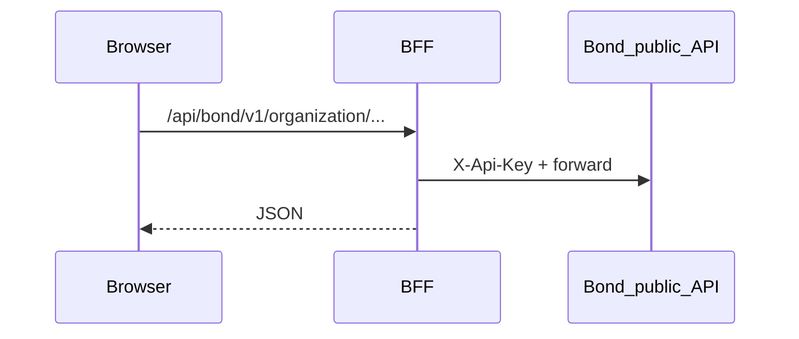

# Rental portal: Phase 1 (discovery + schedule) and Phase 2 (checkout)

**Epic:** [BOND-9840 — Online Rentals 2.0](https://bond-sports.atlassian.net/browse/BOND-9840)  
**UX reference:** [Lovable prototype](https://rentals3.lovable.app/onlinebooking?preset=socceroof)  
**API contract:** [Squad C Swagger](https://public.api.squad-c.bondsports.co/public-api/) · [bond-public-api.json](https://public.api.squad-c.bondsports.co/public-api/bond-public-api.json)  
**Implementation status & handoff:** [`docs/IMPLEMENTATION_AND_ROADMAP.md`](./IMPLEMENTATION_AND_ROADMAP.md)

**Implementation checklist (track in issues or PRs):**

- [ ] BFF proxy hardened (errors, allowed paths) — *baseline exists at `/api/bond/...`*
- [ ] Generated client / types from OpenAPI + extended category `settings`
- [ ] Portal UI: Facility → Category → Activity + URL sync
- [ ] Products list + default-first selection
- [ ] Duration + schedule/settings + schedule grid + views (list/calendar/matrix)
- [ ] Phase 2: auth, `getUser`, `userId` on schedule, required products, questionnaires, `POST` create, cart UI

---

## Repository placement (explicit)

- This app lives in **`rental-portal-fun`** (outside Bond `squad-c` / `apiv2`). **Integration is HTTP only** to the hosted public API.
- Optional local **squad-c** checkout is for Bond-internal docs only; **runtime truth** = hosted OpenAPI.

## Sources aligned

- **`docs/bond/API_CONSUMER_PROMPTS.md`** — BFF + never expose `X-Api-Key` in the browser.
- **`docs/bond/PUBLIC_APIS_FOR_AGENTS.md`** — Endpoint map and read order (controller file paths are for Bond engineers; this repo uses Swagger only).

**Security:** API keys only in server env (e.g. `.env.local`), never `NEXT_PUBLIC_*`.

---

## Barak-review guardrails

- BFF for all `X-Api-Key` traffic; i18n for user-facing and aria strings; currency from API responses; server-truth for booking windows; thin domain helpers in `src/lib` or similar.

---

## Public API surface (Phase 1)

| Step | Operation | Purpose |
|------|-----------|---------|
| Bootstrap | `GET .../online-booking/portals/{portalId}` | Defaults: facilities, categories, activities, views, intervals |
| Products | `GET .../category/{categoryId}/products` | Paginated products; `facilitiesIds`, `sports`, `expand` |
| Schedule context | `GET .../online-booking/schedule/settings` | Resources + `dates` |
| Slots | `GET .../online-booking/schedule` | Per-resource `timeSlots` (requires `date`) |

Optional **`userId`** on schedule calls enables membership-specific windows (Phase 2).

**Category `settings`:** OpenAPI may show a loose `object`; validate against real JSON and extend types locally until the spec tightens.

---

## Phase 1 — Read path (detail)

1. **Config:** `NEXT_PUBLIC_BOND_ORG_ID`, `NEXT_PUBLIC_BOND_PORTAL_ID`, server `BOND_API_*`.
2. **Deep links:** Query params for facility, category, activity, product, date, duration, view — normalize against portal lists after load.
3. **Portal:** Three selects from portal `options`; defaults from API.
4. **Products:** Paginate; default to first; show prices with API `currency`.
5. **Duration:** From `settings.bookingDurations` on the selected category.
6. **Schedule:** Settings for bounds + full schedule for matrix; facility/slot timezones.
7. **Views:** `list` | `calendar` | `matrix` from portal.
8. **Polish:** Loading, errors, empty states, a11y.

**Out of Phase 1:** Cart persistence, auth, questionnaires, `POST` booking.

---

## Phase 2 — Checkout (summary)

- Auth + JWT headers → `getUser` → schedule with `userId` → `getUserRequiredProducts` → checkout questionnaires → `POST .../online-booking/create` → render `OrganizationCartDto`.

---

## Suggested implementation order

1. ~~Scaffold repo + BFF + env~~ *(this repository)*  
2. API client + React Query cache keys  
3. Portal selects + URL sync  
4. Products + default selection  
5. Duration + schedule/settings + schedule  
6. View switcher + grid a11y  
7. Phase 2 checkout stack  

---

*Copied from the Cursor plan; edit here as the source of truth for this repo.*
