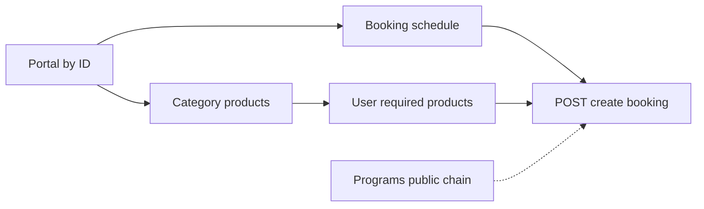

# Bond public & online-booking APIs — handoff for agents and integrators

**Repo:** `~/Documents/GitHub/squad-c/apiv2` (branch `squad-c`) — Nest service under `pricing_ms/`.  
**Hosted spec (canonical for “what’s live”):** [Squad C public Swagger UI](https://public.api.squad-c.bondsports.co/public-api/)  
**Product context:** [BOND-9840 — Online Rentals 2.0](https://bond-sports.atlassian.net/browse/BOND-9840)

---

## Audience

- **Coding agents:** Use this file + the hosted OpenAPI JSON from Swagger UI as the contract. Cross-check controllers listed below if the spec and code diverge.
- **Facility developers:** You need an **organization ID**, often a **portal ID** from Bond backoffice, and a **public API key** (`X-Api-Key`) where the API requires it. Some calls need a **logged-in customer** (JWT headers).

---

## Glossary

| Term | Meaning |
|------|--------|
| **Organization** | The sports facility / tenant in Bond. Almost all routes include `organizationId`. |
| **Program / Session / Segment / Event** | Bond **programs** domain: structured offerings and schedule slots used for registration-style flows. **Not** the same naming as “rental product” in backoffice, but related data may appear in both worlds. |
| **Category** | Rental / online-booking **product category** (facilities configure in backoffice). Used to list bookable **products** for a portal. |
| **Portal** | Online booking **portal** configuration: facilities, categories, activities, default filters, etc. |
| **Public API key** | Org-level key; sent as header **`X-Api-Key`**. Managed in Bond (admin); see `public-api` admin routes below. |

---

## Base URL and paths

- **In code**, many controllers use a prefix **`api/`** (e.g. `api/organization/:organizationId/...`).
- The **published partner bundle** (`pricing_ms/scripts/produce-public-api.ts`) rewrites **`/api/` → `/v1/`** in `bond-public-api.json` and attaches document-level **`X-Api-Key`**.
- **Deployed gateways** may use another version prefix (e.g. **`/v4/`** for internal apps). **Trust the hosted Swagger** for the exact prefix your environment uses.

---

## Authentication quick reference

| Pattern | When |
|--------|------|
| **No guard** | Read-only public GETs (programs chain, schedule, category products list, some portal reads). Still confirm whether gateway requires `X-Api-Key`. |
| **`X-Api-Key`** | Documented on the generated public OpenAPI bundle; enforcement may be at API gateway. |
| **JWT (`JwtAuthGuard` + family guard)** | e.g. `getUserRequiredProducts` — logged-in user context. |
| **JWT + Admin** | Public API **key management** for staff (`/public-api/admin/key/...`). |

---

## Swagger tags (partner-facing `*-public-api`)

Operations whose tag **contains** `public-api` are included in `produce-public-api.ts` output (not only `programs-public-api`).

### 1. `programs-public-api`

**Controller:** `pricing_ms/src/programs/controllers/programs-public.controller.ts`  
**Base path:** `api/organization/:organizationId/programs`

| Method | Path (relative to base) | operationId | Notes |
|--------|-------------------------|---------------|--------|
| GET | `` | `getOrganizationPrograms` | **Published** programs only. |
| GET | `/:programId/sessions` | `getPopulatedSessionsByProgramId` | **Published** sessions. |
| GET | `/:programId/sessions/:sessionId/products` | `getSessionProducts` | **`isPublic: true`** products. |
| GET | `/:programId/sessions/:sessionId/segments` | `getSessionSegments` | |
| GET | `/:programId/sessions/:sessionId/segments/:segmentId/events` | `getSegmentEvents` | Schedule / registration events. |
| GET | `/:programId/sessions/:sessionId/events` | `getSessionEvents` | |

All support **pagination** via shared query patterns (see DTOs in `program-public.dto.ts`, `session-public.dto.ts`, `segment-public.dto.ts`, `event-public.dto.ts`).

---

### 2. `products-public-api`

**Controller:** `pricing_ms/src/product-pricing/controllers/products-public.controller.ts`  
**Base path:** `api/organization/:organizationId`

| Method | Path | operationId | Auth |
|--------|------|-------------|------|
| GET | `/category/:categoryId/products` | `getPaginatedCategoryProducts` | None in controller (confirm gateway). |
| GET | `/products/:productId/user/:userId/required` | `getUserRequiredProducts` | **JWT + `FamilyAccountUpgradedGuard`**; access + ID token headers per Swagger. |

Use **`getUserRequiredProducts`** when the UI must show **required add-on products** for a user and a base product (e.g. checkout).

---

### 3. `portals-public-api`

**Controller:** `pricing_ms/src/online-booking/controllers/public-portals.controller.ts`  
**Base path:** `api/organization/:organizationId/online-booking/portals`

| Method | Path | operationId | Notes |
|--------|------|-------------|--------|
| GET | `/:portalId` | `getPublicPortalById` | Portal must belong to **organizationId**; supports `expand` via `GetPublicOnlineBookingPortalQueryDto`. |

**Legacy / alternate portal read (different tag):**  
`pricing_ms/src/online-booking/controllers/portals.controller.ts` — `GET online-booking/portals/:id` (**published** portal only, **no** `organizationId` in path). May or may not appear on the same hosted spec; check Swagger.

---

### 4. `schedule-public-api`

**Controller:** `pricing_ms/src/online-booking/controllers/schedule-public.controller.ts`  
**Base path:** `api/organization/:organizationId/online-booking`

| Method | Path | operationId | Notes |
|--------|------|-------------|--------|
| GET | `/schedule` | `getBookingSchedule` | Resource **availability / schedule** for online booking (date + options). |
| GET | `/schedule/settings` | `getBookingScheduleSettings` | Schedule-related **settings** for the org booking context. |

Query DTOs: `pricing_ms/src/online-booking/types/dto/schedule.dto.ts`.  
These are the primary **“when can I book?”** reads for **rentals / online booking 2.0** alongside category products.

---

### 5. `online-booking-public-api`

**Controller:** `pricing_ms/src/online-booking/controllers/online-booking.controller.ts`  
**Base path:** `api/organization/:organizationId/online-booking`

| Method | Path | operationId | Auth |
|--------|------|-------------|------|
| POST | `/create` | `cartReservation` | **JWT** — creates **reservation + cart** (`CreateBookingDto` → `OrganizationCartDto`). |

This is the main **write** path for **public online booking** in this slice (contrast with read-only program discovery).

---

### 6. `public-api` (admin — not for facility customer apps)

**Controller:** `pricing_ms/src/public-api/controllers/admin-public-api-key-management.controller.ts`  
**Base path:** `/public-api/admin/key`

| Method | Path | operationId | Auth |
|--------|------|-------------|------|
| GET | `/:organizationId` | `getOrganizationPublicApiKey` | JWT + **Admin** |
| PUT | `/:organizationId` | `createOrganizationPublicApiKey` | JWT + **Admin**; query usage plan |

Staff use this to provision **`X-Api-Key`** for partner integrations.

---

## Suggested read order for a custom booking UI

1. Resolve **portal** (by id): `portals-public-api` **or** legacy `online-booking/portals/:id`.  
2. From portal options, read **organizationId**, **category IDs**, **facility IDs**, **activities**.  
3. **Products** for a category: `getPaginatedCategoryProducts`.  
4. **Availability**: `getBookingSchedule` / `getBookingScheduleSettings`.  
5. If the flow includes **programs** registration-style steps: walk **`programs-public-api`** (programs → sessions → products / segments / events).  
6. For **logged-in** checkout add-ons: `getUserRequiredProducts`.  
7. **Submit booking**: `POST .../online-booking/create` with JWT.

---

## Generating the trimmed OpenAPI JSON

From `pricing_ms/` (after generating full `swagger.json` per project docs):

- Script: `scripts/produce-public-api.ts`  
- Keeps operations whose tags **include** the substring **`public-api`**.  
- Rewrites `/api/` → `/v1/` and sets global **`X-Api-Key`** in the output document.

---

## Pressure-test checklist (for QA / agents)

- **Org boundary:** Wrong `organizationId` with a valid `portalId` (or vice versa) should fail safely.  
- **Pagination:** First/last page, empty lists, large `itemsPerPage`.  
- **Published vs draft:** Programs/sessions only **published**; portals **published** where enforced.  
- **Schedule:** Invalid dates, missing resources, timezone edges.  
- **Auth:** Calls with/without `X-Api-Key`; JWT routes with expired or wrong user.  
- **`getUserRequiredProducts`:** User with no required products; nested required products.  
- **Idempotency / double submit:** `POST create` under concurrency (product expectation).  

---

## Files to open first in `apiv2`

| Area | Path |
|------|------|
| Programs public | `pricing_ms/src/programs/controllers/programs-public.controller.ts` |
| Products public | `pricing_ms/src/product-pricing/controllers/products-public.controller.ts` |
| Portal public | `pricing_ms/src/online-booking/controllers/public-portals.controller.ts` |
| Schedule public | `pricing_ms/src/online-booking/controllers/schedule-public.controller.ts` |
| Booking create | `pricing_ms/src/online-booking/controllers/online-booking.controller.ts` |
| Public API keys | `pricing_ms/src/public-api/controllers/admin-public-api-key-management.controller.ts` |
| OpenAPI filter script | `pricing_ms/scripts/produce-public-api.ts` |

---

*Last updated from `squad-c/apiv2` tree review. Reconcile with [hosted Swagger](https://public.api.squad-c.bondsports.co/public-api/) before shipping integrations.*
